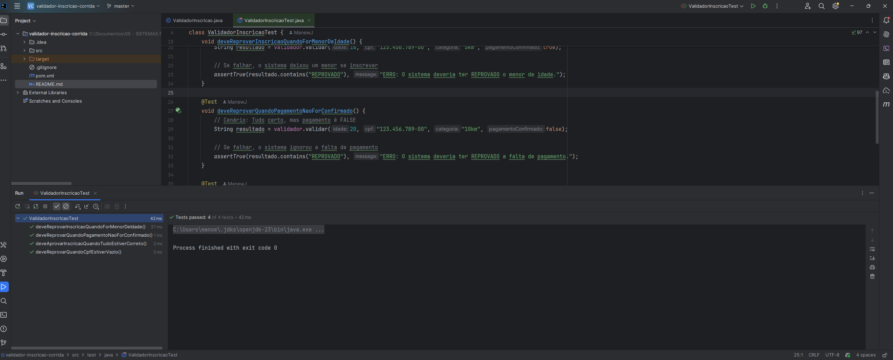
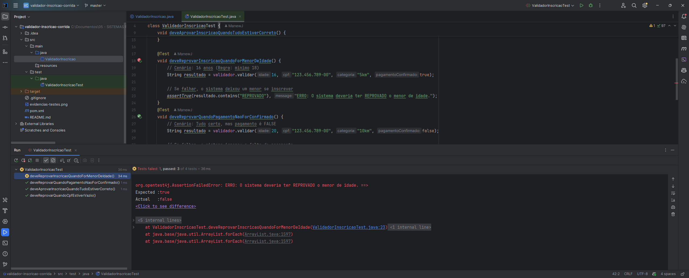

# Validador de Inscrição em Corridas (Testes Unitários)

Este projeto foi desenvolvido como parte da disciplina de **Qualidade de Software**. O objetivo é demonstrar a aplicação de **testes unitários** em Java utilizando **JUnit 5** no ambiente **IntelliJ IDEA**.

## Regras de Negócio Testadas
O sistema valida inscrições baseando-se em quatro pilares fundamentais:
1.  **Idade Mínima:** Apenas atletas com 18 anos ou mais podem se inscrever.
2.  **CPF Obrigatório:** O campo de documento não pode ser nulo ou vazio.
3.  **Confirmação de Pagamento:** A inscrição só é aprovada se o pagamento estiver confirmado.
4.  **Categoria:** O sistema atribui o atleta à categoria escolhida (ex: 5km, 10km, 21km).

##  Tecnologias Utilizadas
* **Java 17+**
* **JUnit 5:** Framework para criação e execução de testes.
* **Maven:** Gerenciador de dependências.
* **IntelliJ IDEA:** IDE de desenvolvimento.

## Como Rodar o Projeto

1.  **Clonar o repositório:**
    ```bash
    git clone [https://github.com/ManewJ/validador-inscricao.git](https://github.com/ManewJ/validador-inscricao.git)
    ```
2.  **Abrir no IntelliJ:**
    * Vá em `File > Open` e selecione a pasta do projeto.
    * Aguarde o Maven carregar as dependências.

## Como Executar os Testes

Para validar a qualidade do software, siga estes passos no IntelliJ:

1.  Navegue até a pasta `src/test/java`.
2.  Abra a classe `ValidadorInscricaoTest`.
3.  Clique com o botão direito no nome da classe e selecione **'Run ValidadorInscricaoTest'**.
4.  **Verificação:** * **Barra Verde:** Todas as regras estão sendo respeitadas.
    * **Barra Vermelha:** Alguma regra de negócio foi alterada ou quebrada.

---

## Evidências de Teste

### 1. Cenário de Sucesso (Caminho Feliz)
Quando todos os dados são válidos, o sistema aprova a inscrição.


### 2. Detecção de Falhas (Segurança do Código)
O sistema foi projetado para alertar o desenvolvedor caso uma regra de negócio seja alterada indevidamente ou os dados inseridos sejam inválidos. Abaixo, um exemplo do teste unitário interrompendo o processo devido a uma falha na validação de idade:



---
Desenvolvido por **Carlos Manoel Justino** 